# TripGenie — Technical Design Specification (v1)


---

## Table of contents

1. [Design principles](#1-design-principles)
2. [System context](#2-system-context)
3. [Logical architecture](#3-logical-architecture)
4. [The agent runtime (LangGraph)](#4-the-agent-runtime-langgraph)
5. [Component catalogue](#5-component-catalogue-purpose--alternatives--rationale)
6. [Concept implementations with worked examples](#6-concept-implementations-with-worked-examples)
7. [Data model & persistence](#7-data-model--persistence)
8. [Detailed end-to-end flows](#8-detailed-end-to-end-flows)
9. [Portkey AI gateway design](#9-portkey-ai-gateway-design)
10. [AWS deployment options & recommendation](#10-aws-deployment-options--recommendation)
11. [Deployment architecture (recommended)](#11-deployment-architecture-recommended)
12. [Observability, evals & CI/CD](#12-observability-evals--cicd)
13. [Security, privacy & cost](#13-security-privacy--cost)
14. [Implementation plan](#14-implementation-plan-mapped-to-milestones)
15. [Appendix: interface contracts](#15-appendix-interface-contracts)

---

## 1. Design principles

These are the non-negotiables that every decision below is tested against.

| # | Principle | Consequence |
|---|---|---|
| P1 | **The LLM is a translator and a narrator, never a calculator or an authority.** | Distance, time, price, ordering and feasibility are computed by deterministic code. The LLM proposes candidates and explains trade-offs. |
| P2 | **Every number is sourced or labelled.** | `sourced_total` vs `estimated_total`; validator blocks unlabelled figures. |
| P3 | **Guardrails are code, not prompts.** | A prompt can be talked out of a rule. A validator cannot. |
| P4 | **The graph is resumable.** | Every node transition checkpoints state; a crash, a timeout, or a human approval pause must not lose work. |
| P5 | **Tools are services, not functions.** | MCP servers with versioned contracts → independently testable, mockable, and swappable (critical given D1–D6 all have known coverage gaps). |
| P6 | **Everything the agent claims is traceable.** | `provenance[]` entry for every fact; `trace_id` joins UI → graph → tool → provider. |
| P7 | **Degrade loudly, never silently.** | Provider down ⇒ labelled degraded mode; never a plausible hallucination. |

---

## 2. System context

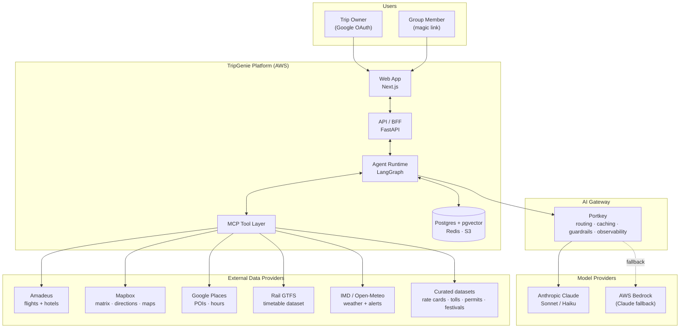

**Why a BFF (FastAPI) between the web app and the agent?** The browser must never hold provider
keys, must not be able to invoke arbitrary graph nodes, and needs a stable streaming contract
that survives graph refactors. The BFF owns auth, rate limiting, SSE fan-out and request
shaping.
*Alternative considered:* Next.js API routes calling LangGraph directly — rejected because the
agent runtime has very different scaling and timeout characteristics (long-running, CPU-bound
solver calls) from the web tier, and coupling them forces one scaling policy on both.

---

## 3. Logical architecture

```mermaid
graph TB
    subgraph L1["Experience Layer"]
        UI1["Chat pane<br/>(streaming)"]
        UI2["Itinerary canvas<br/>(day timeline)"]
        UI3["Map view<br/>(Mapbox GL JS)"]
        UI4["Budget panel<br/>(sourced vs estimated)"]
        UI5["Why-this-plan<br/>(trace explorer)"]
    end

    subgraph L2["Application Layer — FastAPI BFF"]
        AUTH["AuthN/AuthZ<br/>OAuth + magic link"]
        SSE["SSE / WebSocket<br/>streaming"]
        JOBS["Job orchestration<br/>long-running plans"]
        HITL_API["HITL approval API"]
    end

    subgraph L3["Agent Layer — LangGraph"]
        ORCH["Orchestrator<br/>(supervisor)"]
        SUB["Subagents<br/>Transport · Stay · Activities · Budget · Destination"]
        REFLECT["Critic / Reflection"]
        REPLAN["Replan subgraph"]
    end

    subgraph L4["Deterministic Core — pure code, no LLM"]
        SOLVER["Route Optimizer<br/>OR-Tools"]
        SCHED["Scheduler<br/>time-feasibility"]
        VALID["Validator<br/>hard guardrails"]
        LEDGER["Budget Ledger"]
        RECON["Group Reconciler"]
    end

    subgraph L5["Tool Layer — MCP servers"]
        T1["mcp-flights"]
        T2["mcp-rail"]
        T3["mcp-stay"]
        T4["mcp-places"]
        T5["mcp-geo"]
        T6["mcp-car"]
        T7["mcp-weather"]
        T8["mcp-permits"]
        T9["mcp-rag"]
        T10["mcp-optimizer"]
    end

    subgraph L6["Data Layer"]
        PG[("Postgres<br/>trips · state · provenance")]
        VEC[("pgvector<br/>RAG + memory")]
        RDS_C[("Redis<br/>cache · session · locks")]
        S3[("S3<br/>uploads · exports · datasets")]
    end

    L1 --> L2 --> L3
    L3 --> L4
    L3 --> L5
    L4 --> L5
    L5 --> L6
    L3 --> L6
```

**The critical boundary is L3 ↔ L4.** Everything in L4 is deterministic, unit-testable, and
authoritative. The agent layer may *call* L4 but may never *override* it. This is what makes the
zero-tolerance eval targets (layover violations = 0) achievable — they're enforced by a pure
function, not by hoping the model behaves.

---

## 4. The agent runtime (LangGraph)

### 4.1 Full graph

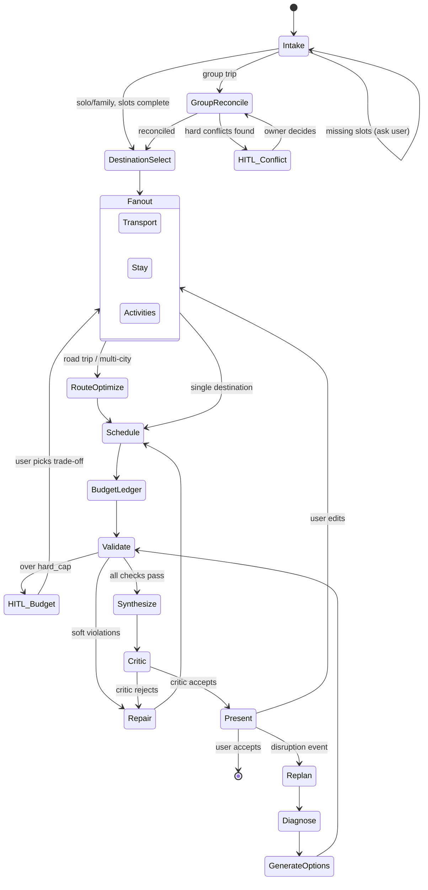

### 4.2 Node responsibilities

| Node | Type | Model | Responsibility |
|---|---|---|---|
| `Intake` | LLM | Haiku | Slot filling, disambiguation, one question at a time |
| `GroupReconcile` | Hybrid | Haiku + code | Extract member constraints (LLM), detect/resolve conflicts (code) |
| `DestinationSelect` | LLM + RAG | Sonnet | Seasonality/theme-aware candidate generation, grounded in RAG + weather |
| `Transport` | Subagent | Sonnet | Flight/rail/bus/road leg options, layover-aware |
| `Stay` | Subagent | Haiku + code | Hotel search, filter by budget/mobility/location |
| `Activities` | Subagent | Sonnet | POI selection, hours/closure aware, interest matching |
| `RouteOptimize` | **Pure code** | — | OR-Tools VRP/TSP over the Mapbox matrix |
| `Schedule` | **Pure code** | — | Place items on a timeline; compute buffers, transfers |
| `BudgetLedger` | **Pure code** | — | Roll up sourced/estimated costs, per-head split |
| `Validate` | **Pure code** | — | All hard guardrails; returns structured violations |
| `Repair` | LLM | Sonnet | Given violations, propose a fix; loop back |
| `Synthesize` | LLM | Sonnet | Narrative itinerary + rationale, citations enforced |
| `Critic` | LLM | Sonnet | Reflection pass against a rubric; can force `Repair` |
| `Present` | — | — | Stream to UI, await user action |
| `Replan` subgraph | Mixed | Sonnet | Diagnose → options → validate → HITL |

### 4.3 Why LangGraph (and what was rejected)

| Option | Verdict | Reasoning |
|---|---|---|
| **LangGraph** ✅ | **Chosen** | Explicit graph = inspectable control flow; built-in checkpointing (P4) with a Postgres saver; native interrupt/resume for HITL; subgraphs map cleanly to the multi-agent topology; streaming per-node |
| CrewAI | Rejected | Role-play abstraction over agents is convenient for demos but the control flow is implicit — hard to enforce "validator always runs before synthesis" |
| AutoGen | Rejected | Conversation-centric; our flow is a DAG with deterministic gates, not a chat between agents |
| Plain Python + function calling | Rejected | We'd rebuild checkpointing, interrupts, streaming and retries ourselves. Reasonable for a prototype, expensive at production scale |
| Temporal + hand-rolled agent | Considered seriously | Best-in-class durability, but adds a second orchestration system; LangGraph's Postgres checkpointer covers our durability needs. Revisit if we need multi-day durable timers for in-trip mode |

### 4.4 Checkpointing & resumability

Every node transition writes a checkpoint (`AsyncPostgresSaver`) keyed by `thread_id = trip_id`.
This gives us three things for free:
1. **HITL pauses** — `interrupt()` before an approval; the graph resumes on the API callback,
   possibly hours later, possibly on a different container.
2. **Crash recovery** — a container dying mid-plan resumes at the last completed node rather
   than re-charging the user for 30s of Sonnet tokens.
3. **Time travel for debugging** — replay a production trip from any node, which is how
   regression eval cases get built (§12).

---

## 5. Component catalogue: purpose / alternatives / rationale

### 5.1 Route Optimizer (`mcp-optimizer`)

**Purpose.** Given N waypoints, a distance/duration matrix, and constraints, produce the
*provably* best feasible visiting order and day-wise split. This is the component that makes
TripGenie more than a chatbot.

**Formulation.** It is not a textbook TSP — it is a **VRP with time windows, capacity and
multiple days**:
- Nodes: must-visit places + candidate enroute stops + overnight-capable nodes
- Arcs: derated Mapbox durations (§5.4)
- Dimensions: `drive_time` (per-day capacity = max drive hours), `distance`, `visit_time`
- Constraints: daily drive cap, no-night-driving windows, mandatory rest every 2.5h, overnight
  node must have a stay and a road-class ≥ state highway, opening-hour time windows
- Objective: minimise `w1·total_drive_time + w2·total_distance − w3·Σexperience_value + w4·backtrack_penalty`

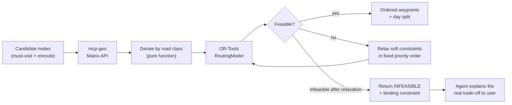

The `INFEASIBLE + binding constraint` return is deliberately designed: when a user asks for
"Bangalore → Leh in 4 days by road", the value is telling them *which* constraint kills it
(daily drive cap) and by how much, not hallucinating a plan.

| Alternative | Why not |
|---|---|
| **LLM reasons out the order** | Fails silently and confidently. On 8+ nodes it produces routes 20–40% worse than optimal and occasionally impossible ones. Also non-deterministic — same input, different route, destroys evals |
| Greedy nearest-neighbour | Simple and fast, but 15–25% worse than optimal and cannot express time windows or daily caps |
| Networkx shortest path | Solves the wrong problem — we need visiting order under multi-day constraints, not point-to-point |
| Commercial VRP SaaS (Routific etc.) | Per-call cost, network dependency, and our problem sizes (≤25 nodes) solve in <1s locally |
| **OR-Tools** ✅ | Free, battle-tested, handles VRPTW natively, deterministic with a fixed seed and time limit, runs in-process |

**Determinism note.** Solver is pinned to a fixed `FirstSolutionStrategy`, `LocalSearchMetaheuristic`
and `time_limit`, so the same input always yields the same route — a prerequisite for evals.

### 5.2 Validator (hard guardrails)

**Purpose.** A single pure function `validate(TripState) -> ValidationReport` that is the final
authority on whether a plan may be shown. Nothing reaches the user without passing it.

```python
@dataclass
class Violation:
    code: str            # LAYOVER_TOO_SHORT, DRIVE_HOURS_EXCEEDED, OVER_HARD_CAP, ...
    severity: Literal["blocking", "warning"]
    segment_ids: list[str]
    detail: str
    suggested_fix: str | None   # machine-readable hint for the Repair node
```

Checks implemented (all pure, all unit-tested against fixtures):

| Code | Rule | Severity |
|---|---|---|
| `LAYOVER_TOO_SHORT` | §4.6 buffer table of the product spec | blocking |
| `DRIVE_HOURS_EXCEEDED` | derated drive time > daily cap | blocking |
| `NIGHT_DRIVING` | drive segment intersects 22:00–06:00 | blocking (overridable by explicit user opt-in) |
| `VENUE_CLOSED` | activity outside opening hours / on a closed day | blocking |
| `OVER_HARD_CAP` | ledger total > `budget.hard_cap` | blocking (forces HITL) |
| `HARD_CONSTRAINT_BREACH` | mobility/allergy constraint violated | blocking |
| `PERMIT_LEAD_TIME` | ILP/PAP required, insufficient lead time | blocking |
| `UNSOURCED_CLAIM` | figure with no `provenance[]` entry and no `estimated` label | blocking |
| `RAIL_AVAILABILITY_ASSERTED` | availability claim on a GTFS-only rail segment | blocking |
| `IMPLAUSIBLE_DURATION` | leg implies >80 km/h non-expressway | blocking |
| `KM_CAP_OVERRUN` | route km > rental km cap × days, cost not surfaced | blocking |
| `TIGHT_CONNECTION` | buffer within 15% of the minimum | warning |
| `STALE_RATE_CARD` | rate card `as_of` > 90 days | warning |
| `MONSOON_GHAT_RISK` | route crosses landslide-prone ghat in monsoon | warning |

*Alternative considered:* guardrails as LLM-judge calls. Rejected for blocking rules — a judge
is probabilistic, costs tokens and latency, and cannot give a zero-violation guarantee. LLM
judging is used **only** for subjective quality in evals (§12).

### 5.3 Scheduler

**Purpose.** Convert an ordered set of items into an absolute timeline with real buffers.
Handles timezone (single TZ in v1, but modelled properly), transfer times between venues,
meal windows, check-in/out constraints, and the layover table.

Deliberately separate from the optimizer: the optimizer decides *order*, the scheduler decides
*clock times*. Keeping them apart means a user edit ("start day 2 later") re-runs a 5ms
scheduler rather than a 1s solver.

### 5.4 `mcp-geo` and the derate model

**Purpose.** All distance/duration/geometry, plus the India-specific correction layer.

```python
DERATE = {          # multiplier applied to raw Mapbox duration
    "motorway": 1.00,
    "trunk": 1.05,
    "primary": 1.15,      # NH with town crossings
    "secondary": 1.30,    # state highway
    "tertiary": 1.45,
    "unclassified": 1.70,
    "ghat": 1.60,         # additive flag, multiplies on top
}
```
Calibrated against a ground-truth corridor set (Bangalore–Goa, Delhi–Manali, Chennai–Munnar,
Guwahati–Tawang, Mumbai–Pune). **The derated duration is the only one that ever leaves this
module** — raw Mapbox durations are not exposed, so no downstream component can accidentally
use the optimistic figure.

### 5.5 Budget Ledger

**Purpose.** Authoritative money. Pure code, double-entry style: every line item carries
`{amount, currency, category, source_type: sourced|estimated, provenance_ref, per_head_split}`.

Key rule: `sourced_total` and `estimated_total` are never summed into a single headline number
without the split being visible. The ±2% accuracy target applies only to `sourced_total`.

### 5.6 Group Reconciler

**Purpose.** Deterministic conflict resolution over member constraints.

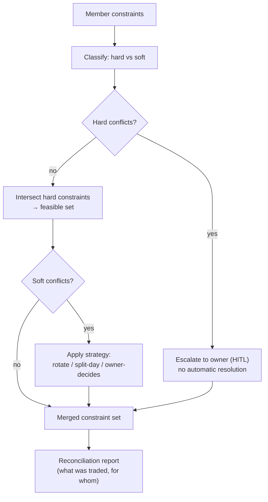

Hard constraints are **intersected, never traded**. An LLM asked to "balance everyone's needs"
will cheerfully schedule a 4 km hike for the member with a mobility constraint; a set
intersection will not.

### 5.7 MCP tool layer

**Purpose.** Every external data source behind a uniform, versioned, independently deployable
contract returning `{data, source, fetched_at, ttl, confidence}`.

| Alternative | Why not |
|---|---|
| Direct SDK calls inside graph nodes | Fastest to write, but couples the graph to provider schemas. Given D1–D6 all have known coverage gaps and planned `[v2]` swaps, this would mean touching the graph every time we change a provider |
| LangChain tools only | Fine in-process, but not independently testable/deployable and no cross-process reuse |
| **MCP servers** ✅ | Uniform contract, process isolation (a hanging Amadeus call can't stall the graph), independently mockable for evals, reusable by future clients (CLI, WhatsApp bot), and provider swaps are a server-side change |

**Deployment note:** in v1 MCP servers run as sidecar processes in the same ECS task (stdio
transport) to avoid network hops; the contract allows promoting any of them to a standalone
service (HTTP/SSE transport) if one needs independent scaling.

### 5.8 Memory subsystem

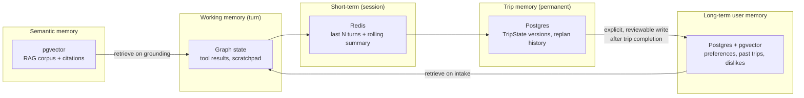

**Why writes to long-term memory are explicit and reviewable:** silent profile drift is the
most common production failure of memory systems — the agent learns "user dislikes temples"
from one declined suggestion and never offers one again. Writes happen at defined points
(post-trip, explicit user statement), are shown to the user, and are editable/deletable.

*Alternative considered:* a managed memory service (Zep/Mem0). Rejected for v1 — another
vendor, and our memory schema is domain-specific (pace preference, budget habits, mobility)
rather than generic conversational recall.

### 5.9 RAG subsystem

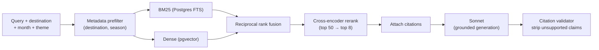

**Hard rule:** prices, availability and opening hours are **never** answered from RAG — those
come from live tools or are labelled estimates. RAG answers *judgement* questions ("is Coorg
worth it in July", "is this road open in winter", "which ghat section is landslide-prone").
This split is the difference between RAG helping and RAG becoming a hallucination source.

*Alternative considered:* a managed vector DB (Pinecone/Weaviate). Rejected — pgvector keeps
one database, supports transactional consistency between chunks and their source metadata, and
our corpus (~10⁵ chunks) is far below the scale where a dedicated vector store pays for itself.

---

## 6. Concept implementations with worked examples

This section maps each concept we discussed to concrete code paths and a real trace.

### 6.1 Agent Loop

The loop is the LangGraph supervisor cycle: **perceive state → select next node → act →
write state → re-evaluate**. It is bounded, not open-ended.

```python
# Simplified supervisor routing
def route(state: TripState) -> str:
    if state.missing_slots:                 return "Intake"
    if state.is_group and not state.reconciliation: return "GroupReconcile"
    if not state.candidates:                return "DestinationSelect"
    if state.needs_fanout:                  return "Fanout"
    if state.is_road_trip and not state.route_solution: return "RouteOptimize"
    if not state.schedule:                  return "Schedule"
    report = state.guardrail_report
    if report.blocking and state.repair_attempts < MAX_REPAIRS: return "Repair"
    if report.blocking:                     return "HITL_Escalate"
    if not state.narrative:                 return "Synthesize"
    if not state.critic_passed:             return "Critic"
    return "Present"
```

**Loop bounds (production hygiene):** `MAX_REPAIRS = 3`, global node-visit cap, wall-clock
budget of 90s for a full plan, and a token budget per request. Exceeding any of them exits to
`HITL_Escalate` with a partial plan and an honest explanation — never an infinite loop, never
a silent truncation.

### 6.2 ReAct (Reason → Act → Observe)

ReAct operates **inside** subagent nodes, where the model genuinely needs to decide what to
look up next. It does *not* govern the top-level flow (that's the deterministic graph).

**Worked example — Transport Subagent, "Hyderabad → Ziro, 18–24 Nov, 2 adults":**

```
Thought:  Ziro has no airport. Nearest airport is Lilabari (IXI), ~100 km.
          Need to check Hyderabad→IXI connectivity first.
Action:   mcp-flights.search(from=HYD, to=IXI, date=2026-11-18)
Observation: No same-day itinerary under 14h. Best: HYD→GAU 2h40, then GAU→IXI
          (1 daily, 07:15). Overnight in Guwahati implied.
Thought:  Alternative: HYD→GAU flight + road GAU→Ziro (~450 km). Need drive time.
Action:   mcp-geo.distance_matrix(GAU, Ziro)
Observation: 452 km, raw 9h10. Road class mix: primary + tertiary + ghat.
Thought:  Derated that's ~12h20 — exceeds the 8h hard daily cap. Must split
          across two days with an overnight, or take the IXI flight.
Action:   mcp-stay.hotel_search(near=Tezpur, date=2026-11-18)   # midpoint stay
Observation: 6 properties, ₹2,400–5,800.
Thought:  Two viable shapes. Option A (flight to IXI) saves a day but the GAU→IXI
          leg is a single daily departure — a HYD delay cascades into a lost day.
          Option B (road, split) is slower but resilient. Also: Ziro requires an
          Inner Line Permit.
Action:   mcp-permits.permit_requirements(state=Arunachal Pradesh)
Observation: ILP required for non-residents; ~3–5 working days lead time.
Thought:  Lead time is fine for a Nov trip planned now. Surface both options with
          the single-daily-flight risk stated explicitly.
```

Note what the model did **not** do: it did not compute the derated drive time (that came from
`mcp-geo`), did not decide the 8h cap was breached on its own (the scheduler flags it), and did
not assert permit timelines from memory (it called the tool). That division is P1 in practice.

### 6.3 Tool Use

Tools are Claude-native tool-use calls bridged to MCP servers. Every tool has:
- a strict JSON schema (Pydantic → tool schema)
- an idempotency key for retry safety
- a timeout + circuit breaker
- a normalised error taxonomy the agent is trained to handle:
  `UNAVAILABLE` (provider down → degrade), `NO_RESULTS` (valid, empty → widen search),
  `INVALID_INPUT` (agent's fault → fix and retry), `RATE_LIMITED` (back off), `STALE` (use + label)

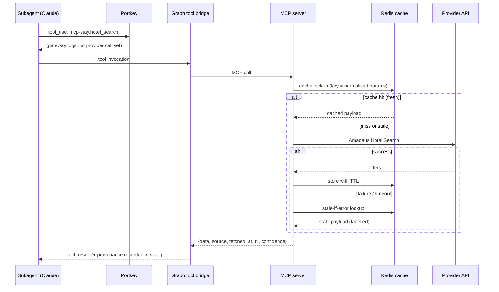

### 6.4 Grounding (and "grounding at its hardest")

Three enforcement layers:

1. **Provenance capture.** Every tool result writes `provenance[] = {claim_key, source, url,
   fetched_at, ttl, confidence}` into state before the LLM ever sees it.
2. **Citation-constrained synthesis.** `Synthesize` receives only the retrieved/tool-derived
   facts, and must emit claims tagged with a `provenance_ref`.
3. **Post-generation validator.** Any numeric or factual claim without a matching
   `provenance_ref` or an `estimated` label is a `UNSOURCED_CLAIM` blocking violation.

**Worked example — grounding at its hardest.** User asks for a budget stay in Ziro.
Amadeus returns nothing (D3's known gap — no chain hotels there).

- *Wrong behaviour* (what an ungrounded agent does): "Hotel Blue Pine, ₹1,800/night, good
  reviews" — plausible, specific, and invented.
- *TripGenie behaviour:* `mcp-stay` returns `NO_RESULTS` from Amadeus, falls back to the Google
  Places + curated layer, and returns three real properties **with no rates**. The ledger books
  them as `estimated` at a regional band (₹1,500–3,000 for Arunachal homestays, from the curated
  dataset, `as_of` stamped). The UI shows "estimated — rates not verified" and a deep-link. The
  narrative says so in words. `sourced_total` excludes it.

### 6.5 Memory (worked example)

**Turn 1, March:** user plans Coorg, rejects two 6 a.m. starts, picks boutique homestays over
a Taj property twice.
**Post-trip:** the memory writer proposes, and the user confirms:
`{pace: "no starts before 08:30", lodging_style: "boutique/homestay > chain", confidence: 0.7}`.
**Turn 1, next November:** `Intake` retrieves the profile; `DestinationSelect` and `Stay`
receive it as soft preferences. The first Ziro plan already avoids dawn departures and leads
with homestays — and the UI shows *"applied from your saved preferences"* with an undo.

The undo matters: it's what keeps the memory honest and keeps the user in control (DPDP).

### 6.6 MCP (vs. a direct tool wrapper)

Both are supported by the same graph-side interface; the difference is deployment topology.

| | Direct wrapper | MCP server |
|---|---|---|
| Latency | Lowest (in-process) | +1–3ms stdio, +10–30ms HTTP |
| Isolation | None — a hung call blocks the worker | Process-isolated, killable |
| Testability | Mock at the Python level | Mock at the protocol level; same mocks used by evals |
| Reuse | LangGraph only | Any MCP client (CLI, future WhatsApp bot, Claude Desktop for internal debugging) |
| Swap a provider | Touch graph code | Server-side only |

v1 uses MCP over stdio as sidecars — near-zero latency cost, all the isolation and swap
benefits. `mcp-optimizer` is the one that most benefits from isolation: OR-Tools is CPU-bound
and would otherwise block the async event loop.

### 6.7 Planning & Replanning

Planning is the forward pass. **Replanning is a first-class subgraph**, not a re-run.

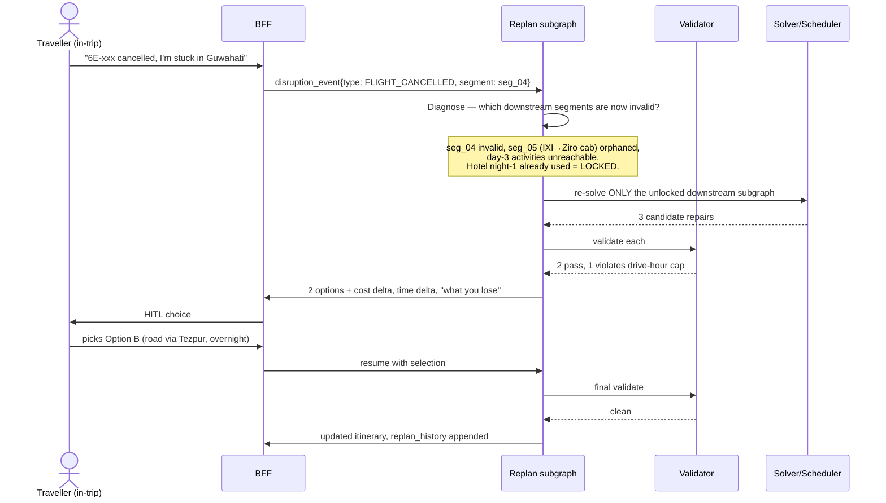

**Locked segments** are the key design element: anything the user has actually booked is
immutable. The replanner mutates only the unlocked downstream subgraph, which is also what
makes the <20s latency target achievable — we re-solve a handful of nodes, not the whole trip.

### 6.8 Optimization algorithm as a tool (not LLM reasoning)

**Worked example — "Bangalore → Goa, 5 days, must see Hampi and Badami, back to Bangalore".**

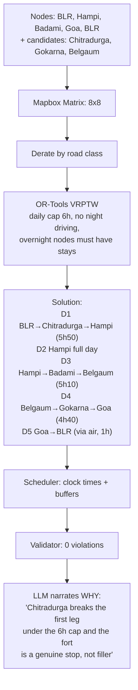

Contrast: asked directly, an LLM routinely proposes BLR → Hampi → Goa → Badami → BLR, which
backtracks ~180 km, or BLR → Hampi in one day with a 7h50 derated drive that breaches the cap.
It then defends the route confidently. The solver simply cannot produce those.

**The LLM's actual job here** is the last box: choosing *which* candidate stops to feed the
solver (Chitradurga is interesting; a random truck stop is not) and explaining the result in
human terms. That's the correct division of labour — LLM for semantics, solver for structure.

### 6.9 Multi-Agent System

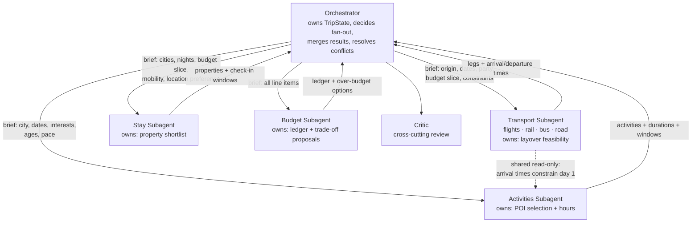

**Why a supervisor topology, not a peer-to-peer swarm:**

| Topology | Verdict |
|---|---|
| **Supervisor/orchestrator** ✅ | One owner of state, deterministic merge point, bounded token cost, debuggable. Conflicts resolved by code at the merge, not by negotiation |
| Peer-to-peer negotiation | Rejected: token cost grows superlinearly, non-deterministic convergence, and "the two agents argued and settled on something infeasible" is a real failure mode |
| Single mega-agent | Rejected: one prompt holding flights + hotels + activities + budget rules exceeds reliable instruction-following; also serialises what should be parallel |
| Hierarchical (sub-supervisors) | Over-engineered for 4 subagents. Revisit if the subagent count grows past ~8 |

**Parallelism:** Transport / Stay / Activities fan out concurrently (`asyncio.gather`), which is
where most of the latency budget is won — 3 sequential Sonnet calls with tool loops would blow
the 45s p95 target.

**Handoff contract.** Subagents receive a *brief* (a narrow projection of state), not the whole
TripState — this keeps prompts small, prevents cross-contamination, and makes each subagent
independently eval-able.

### 6.10 Guardrails — the layover rule, end to end

The minimum-layover buffer is the canonical example of a hard rule, so here is every layer it
passes through:

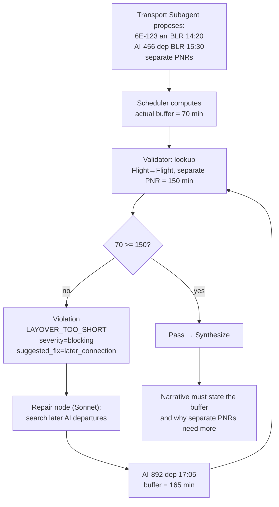

Properties that make this a *real* guardrail rather than a suggestion:
- The rule lives in a **data table**, not a prompt — auditable, unit-testable, changeable
  without touching a model.
- It is checked **after** the LLM has finished, on the final artifact, so no amount of clever
  model output bypasses it.
- The failure is **structured** (`suggested_fix`), so the Repair loop is targeted rather than
  "try again".
- Same-PNR vs separate-PNR distinction encodes real domain knowledge: with separate tickets,
  a missed connection is the passenger's loss. The narrative is required to say this.
- The `Repair` loop is bounded; three failed repairs escalate to the user with the honest
  message "there is no legal connection on this date under our minimum-buffer rule."

### 6.11 HITL (Human-in-the-Loop)

Four defined interrupt points, implemented with LangGraph `interrupt()` + checkpoint resume:

| Trigger | What the user sees | Resume path |
|---|---|---|
| Hard group conflict | Conflict description + 2–3 resolution strategies | `GroupReconcile` |
| Over `hard_cap` | Ledger breakdown + ≥2 concrete reduction options with exact savings | `Fanout` |
| Permit/document gap | Requirement, lead time, official link | `Validate` |
| Any disruption re-plan | ≥2 options with cost/time delta and "what you lose" | `Replan` |
| Repair budget exhausted | Honest "can't satisfy all constraints" + the binding one | `Intake` |

Because the graph is checkpointed, an interrupt can sit for hours (user closes the laptop) and
resume on a different container. No in-memory state is required to survive.

### 6.12 Reflection (Critic)

The `Critic` node runs on the *complete* draft, scoring against a fixed rubric:

```
1. Feasibility beyond the hard rules — is day 3 realistic for a family with a 6-year-old,
   or technically legal but exhausting?
2. Coherence — does the theme hold, or is it a list of top-rated pins?
3. Grounding — every claim carries provenance; estimates labelled.
4. Budget honesty — trade-offs stated, not buried.
5. Constraint coverage — every stated preference addressed or explicitly declined with a reason.
6. Redundancy — three forts in four days?
```

Critic output is structured (`pass | revise` + targeted findings), and a `revise` sends specific
findings to `Repair`, not a vague "make it better".

**Worked example.** Draft passes every hard rule. Critic flags: *"Day 2 has 5 activities with
18 min average transfer buffer for a party including a 6-year-old and a 71-year-old — legal but
not realistic; and the 'spiritual' theme is absent after day 2."* Repair drops two activities,
widens buffers, and adds an evening aarti — the plan gets *worse* on density and *better* on
being a trip someone would actually enjoy. That judgement is exactly what a deterministic
validator cannot make, and exactly why reflection is a separate layer from guardrails.

**Cost control:** Critic runs once per plan by default, with a second pass only if the first
returned `revise`. It is skipped for trivial edits (e.g. "swap this hotel").

---

## 7. Data model & persistence

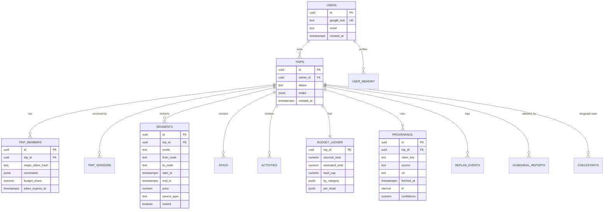

**Storage choices**

| Data | Store | Why |
|---|---|---|
| Trips, segments, ledger, provenance | Postgres (RDS/Aurora) | Relational integrity matters — a segment without provenance must be impossible |
| LangGraph checkpoints | Postgres (same DB, separate schema) | Transactional with trip writes; no second system |
| Embeddings (RAG + memory) | pgvector | One DB, transactional with source metadata |
| Session, cache, locks, rate limits | ElastiCache Redis | TTL semantics, `stale-if-error` cache pattern |
| Uploads (tickets), exports (PDF), curated datasets | S3 | Cheap, versioned, lifecycle rules |

**Caching strategy** (this is a major cost lever):

| Data | TTL | Notes |
|---|---|---|
| Mapbox matrix | 30 days | Keyed by node-set hash; roads don't move |
| Geocoding | 90 days | |
| Hotel offers | 30 min | Price-sensitive; re-checked at handoff (R10) |
| Flight offers | 15 min | Most volatile |
| POI hours/details | 7 days | |
| Weather forecast | 3 h | |
| Climate norms, festivals, permits, rate cards | 30–90 days | Curated, versioned |
| LLM responses | Portkey semantic cache | §9 |

---

## 8. Detailed end-to-end flows

### 8.1 Flow A — First plan (happy path)

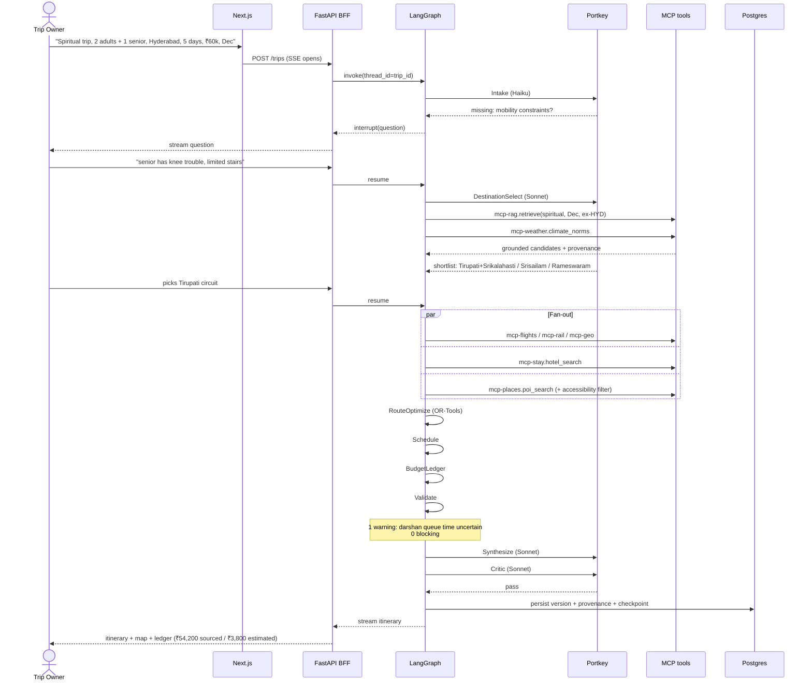

### 8.2 Flow B — Over budget (HITL)

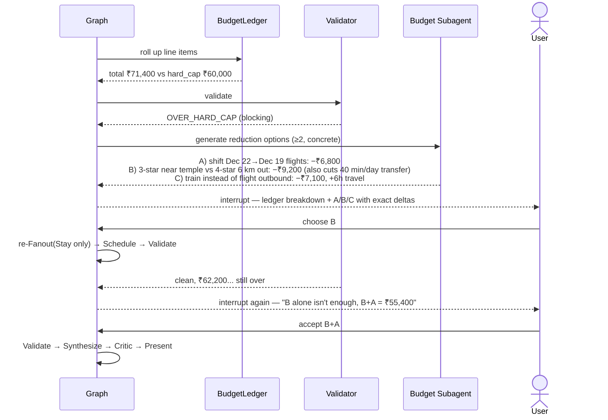

Note the honesty in the second interrupt: the agent does not quietly relax `hard_cap`, and it
does not stop at one round of trade-offs.

### 8.3 Flow C — In-trip disruption

Covered by the sequence diagram in §6.7. Additional production details:
- Disruption events arrive from the user (v1) via the "something went wrong" action.
- The replan subgraph runs with a **reduced node budget** and Sonnet with a tighter token cap to
  hit <20s; it skips `Critic` unless the user asks for a deeper look.
- `replan_history` is appended so the post-trip review can show what actually happened.

### 8.4 Flow D — Group intake

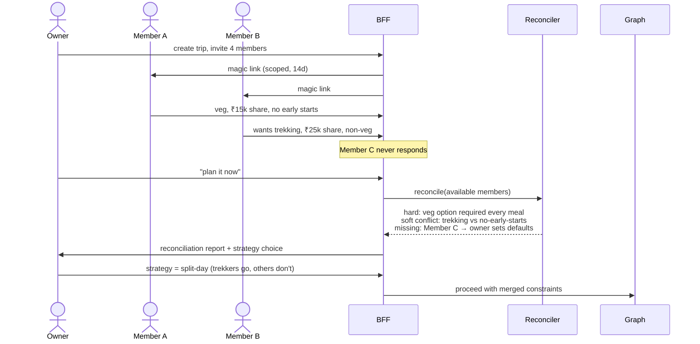

---

## 9. Portkey AI gateway design

**Purpose.** A single control point between the agent runtime and all LLM providers — routing,
fallback, caching, retries, budget enforcement, key management and LLM observability.

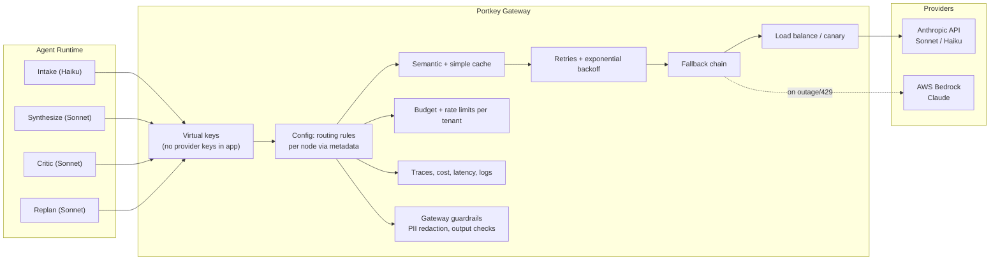

### 9.1 Why Portkey (and alternatives)

| Option | Verdict |
|---|---|
| **Portkey** ✅ | Chosen. Unified gateway + observability + semantic caching + fallback + per-tenant budgets in one layer; config-driven so routing changes don't require a deploy; OpenAI-compatible surface keeps the app code provider-neutral |
| Direct Anthropic SDK | Simplest, but every concern (retry, fallback, cost attribution, caching, key rotation) becomes app code, and cross-provider fallback means a second SDK path |
| LiteLLM proxy | Strong OSS alternative; we'd self-host and operate it. Chosen against because Portkey bundles observability + guardrails, and self-hosting another stateful proxy on day one adds ops load — but LiteLLM is the documented exit route if we ever need to leave |
| AWS Bedrock only | Attractive (VPC-native, IAM, no egress) but ties routing to one provider's model availability and regional rollout lag. **Kept as the fallback target** — best of both |
| Cloudflare AI Gateway | Good caching/observability, thinner on routing policy and budget controls |

### 9.2 Configuration design

```json
{
  "strategy": { "mode": "fallback" },
  "targets": [
    {
      "virtual_key": "anthropic-prod",
      "override_params": { "model": "claude-sonnet-4-5" },
      "retry": { "attempts": 2, "on_status_codes": [429, 500, 502, 503] }
    },
    {
      "virtual_key": "bedrock-prod",
      "override_params": { "model": "anthropic.claude-sonnet-4-5-v1:0" }
    }
  ],
  "cache": { "mode": "semantic", "max_age": 3600 },
  "metadata": { "node": "{{node}}", "trip_id": "{{trip_id}}", "tier": "{{tier}}" }
}
```

- **Per-node routing** via metadata: `Intake` → Haiku config, `Synthesize`/`Critic` → Sonnet
  config. Changing a node's model is a Portkey config edit, not a deploy.
- **Semantic caching** is enabled **only** for genuinely repeatable, non-personalised calls
  (destination blurbs, seasonality explanations). It is **disabled** for synthesis, critic and
  replan — caching a personalised itinerary across users would be both wrong and a privacy leak.
- **Budget guards**: per-trip token ceiling, per-org daily spend cap, alerting at 80%.
- **Cost attribution**: `trip_id` + `node` metadata on every call → exact cost-per-plan, which
  feeds the §12 cost metric directly.
- **Gateway guardrails** complement (never replace) our code guardrails: PII redaction on
  inbound, basic output checks. Domain rules (layover, budget) stay in the Validator — a
  gateway can't know that a 70-minute connection is illegal.

### 9.3 Failure behaviour

| Failure | Behaviour |
|---|---|
| Anthropic 429 | Portkey retries with backoff, then falls back to Bedrock |
| Anthropic outage | Fallback to Bedrock; if both down, graph **blocks** synthesis and returns the deterministic skeleton (route + timings + costs from the solver) labelled "narrative unavailable" — the deterministic core still produces a usable plan |
| Portkey outage | App-level direct-to-provider escape hatch behind a feature flag (`GATEWAY_BYPASS=1`), keys in Secrets Manager, observability degrades but service survives |
| Budget cap hit | Requests rejected at the gateway with a typed error; user sees "planning capacity reached", ops gets paged |

That third row matters: **Portkey must not be a single point of failure.** The bypass path is
tested in CI.

---

## 10. AWS deployment options & recommendation

### 10.1 Option comparison

| | **A. ECS Fargate** | **B. EKS** | **C. Lambda + Step Functions** | **D. App Runner** | **E. EC2 ASG** |
|---|---|---|---|---|---|
| Ops burden | Low | High | Low–medium | Lowest | High |
| Long-running requests | Good (no hard cap) | Good | ⚠️ 15 min Lambda cap | 120s request cap ⚠️ | Good |
| CPU-bound OR-Tools | Good (task sizing) | Good | Poor (cold starts, CPU limits) | Weak | Good |
| Persistent MCP sidecars | Native (multi-container task) | Native | Awkward | No | Native |
| WebSocket/SSE streaming | Via ALB | Via ALB/Ingress | API GW WS + extra glue | Limited | Via ALB |
| Scale-to-zero | No (min 1 task) | No | Yes | Near | No |
| Cost at low traffic | ~$70–150/mo | ~$220+/mo (control plane + nodes) | Lowest | ~$50/mo | Medium |
| Cost at scale | Good | Best | Poor (long LLM calls billed as duration) | Poor | Best |
| Complexity to ship M1 | **Low** | High | Medium | Lowest | Medium |
| Fit for LangGraph checkpoint/resume | Excellent | Excellent | Good (SFN mirrors it, but duplicates LangGraph) | Poor | Excellent |

### 10.2 Recommendation

**Start on ECS Fargate (Option A). Keep EKS as the scale-out path.**

Reasoning:
- Our unit of work is a **long-running, stateful-ish, CPU-and-IO mixed** plan (30–90s, with a
  1s OR-Tools burst and many concurrent tool calls). Lambda's 15-minute cap is fine but its
  cold starts and CPU profile are poor for OR-Tools, and paying Lambda duration for a 45s call
  that is 90% waiting on Anthropic is the worst cost shape available.
- MCP sidecars map 1:1 onto Fargate multi-container task definitions.
- App Runner's request timeout rules out synchronous planning.
- EKS gives more control than we need for M1–M4 and costs ~$150/mo before running anything.

**Hybrid element worth keeping:** background/async work (nightly eval runs, RAG re-indexing,
dataset refresh, price-drift re-checks) runs on **ECS scheduled tasks** or **Lambda**, where
scale-to-zero genuinely pays.

### 10.3 Sync vs async planning

Even on Fargate, a 45–90s synchronous HTTP request is fragile. Design:

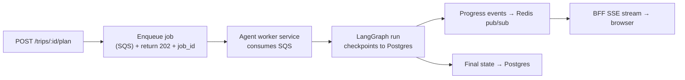

This also makes HITL natural: an interrupt just ends the worker's turn; the resume is a new
message on the queue.

---

## 11. Deployment architecture (recommended)

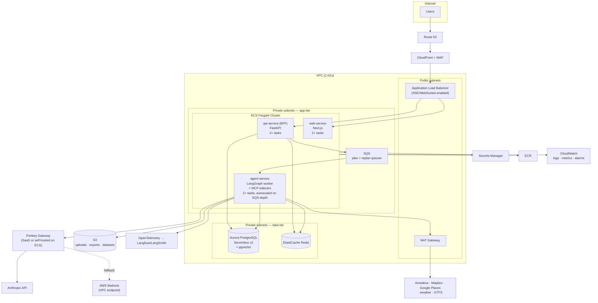

### 11.1 Service sizing (initial)

| Service | Task size | Count | Scaling signal |
|---|---|---|---|
| `web-service` | 0.5 vCPU / 1 GB | 2 | ALB request count |
| `api-service` | 1 vCPU / 2 GB | 2 | CPU + active SSE connections |
| `agent-service` | 2 vCPU / 4 GB | 2–10 | **SQS queue depth** (the right signal — CPU looks idle while waiting on Anthropic) |
| MCP sidecars | 0.25 vCPU each | co-located | n/a |
| Aurora Serverless v2 | 0.5–4 ACU | — | auto |
| Redis | cache.t4g.small | 1 (2 with replica in prod) | — |

Autoscaling on **queue depth rather than CPU** is a deliberate choice: an agent task spends most
of its wall clock blocked on LLM and provider I/O, so CPU-based autoscaling under-provisions
badly exactly when demand spikes.

### 11.2 Environments

| Env | Notes |
|---|---|
| `dev` | Single-AZ, Aurora Serverless min 0.5 ACU, `FAKE_PROVIDERS=1` by default, Portkey dev virtual keys with a hard spend cap |
| `staging` | Prod-shaped, real providers, sandbox credentials, full eval suite runs here nightly |
| `prod` | Multi-AZ, deletion protection, PITR, WAF, canary deploys |

### 11.3 Portkey deployment choice

| Option | When |
|---|---|
| **Portkey SaaS** ✅ v1 | Fastest, zero ops, full observability UI. Egress to Portkey over TLS; no PII in prompts beyond trip context (and gateway-level redaction on) |
| Portkey self-hosted on ECS | If data residency (India DPDP) or latency demands it. The gateway is stateless, so this is a small ECS service + Redis — a planned, low-risk migration, not a rewrite |

Decision: start SaaS, keep the self-hosted path documented and the config portable.

### 11.4 IaC & deployment

- **Terraform** for infrastructure (VPC, ECS, Aurora, Redis, S3, IAM, WAF).
  *Alternative:* CDK — rejected for infra because Terraform's plan/state model is clearer for
  review; but CDK is fine if the team prefers TypeScript end-to-end.
- **Blue/green via CodeDeploy** on ECS for the API and agent services.
- **Migrations**: Alembic, run as a one-off ECS task gated before the new task set shifts.
- **Feature flags** per milestone so M3/M4/M5 capabilities ship dark.

---

## 12. Observability, evals & CI/CD

### 12.1 Three-layer observability

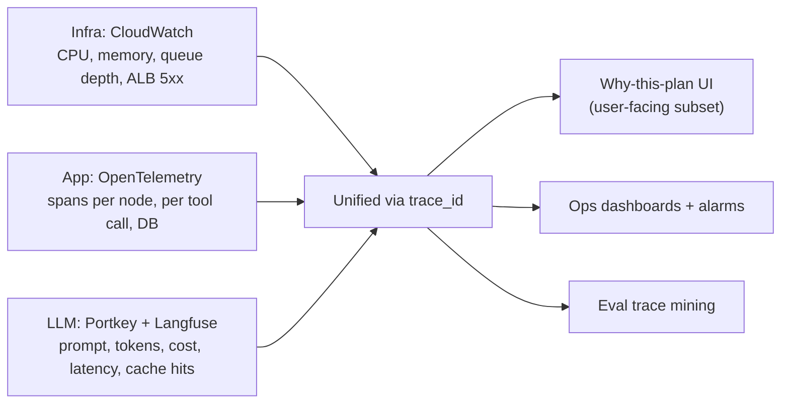

Every plan carries a `trace_id` from the browser through the BFF, the graph, each node, each
tool call and each Portkey request — so "why did this trip cost ₹4 in tokens and take 78s" is
answerable in one query.

### 12.2 Eval harness

```mermaid
flowchart LR
    A["Golden set (50)"] --> R["Eval runner"]
    B["Adversarial set"] --> R
    C["Disruption set (20)"] --> R
    D["Regression set (grows)"] --> R
    R --> E["Deterministic assertions<br/>(Validator as oracle)"]
    R --> F["LLM-as-judge<br/>(Sonnet, separate key + prompt)"]
    E --> G{"Any zero-target<br/>regressed?"}
    F --> H["Quality score vs baseline"]
    G -->|yes| I["Block merge"]
    G -->|no| J["Publish report"]
    H --> J
```

- Runs with `FAKE_PROVIDERS=1` against recorded provider fixtures ⇒ deterministic, free, fast.
- A nightly job runs a smaller suite against **real** providers in staging to catch provider
  drift (schema changes, coverage regressions) — the failure mode fixtures can't catch.
- Every production incident becomes a permanent regression case (P6 makes this cheap: replay
  the checkpoint).

### 12.3 CI/CD pipeline

```mermaid
flowchart LR
    A["PR"] --> B["Lint + type check<br/>ruff, mypy"]
    B --> C["Unit tests<br/>validator, solver, scheduler, ledger"]
    C --> D["Contract tests<br/>MCP servers vs fixtures"]
    D --> E["Eval suite<br/>(fixtures)"]
    E --> F{"Gates pass?"}
    F -->|no| X["Block"]
    F -->|yes| G["Build + push to ECR"]
    G --> H["Deploy staging<br/>(blue/green)"]
    H --> I["Smoke + nightly real-provider evals"]
    I --> J["Manual approve"]
    J --> K["Deploy prod<br/>(canary 10% → 100%)"]
```

Note that the deterministic core (validator, solver, scheduler, ledger) has **ordinary unit
tests with hard assertions** — no LLM involved. That's the majority of the correctness surface,
and it's testable like normal software precisely because of P1.

---

## 13. Security, privacy & cost

### 13.1 Security

| Control | Implementation |
|---|---|
| Secrets | AWS Secrets Manager; provider keys never in env files, never in LLM context; Portkey virtual keys mean the app holds no Anthropic key |
| Network | Private subnets for app + data; no public DB; egress via NAT with an allowlist; Bedrock via VPC endpoint |
| AuthZ | Row-level checks on `trip_id` + role (owner/member/viewer); member tokens scoped to one member record |
| Magic links | Signed, single-purpose, hashed at rest, 14-day expiry, revocable by owner |
| Prompt injection | Untrusted content (RAG chunks, scraped pages, uploaded ticket OCR) is wrapped and marked untrusted; tools are allowlisted per node; **the agent has no write/transaction scope at all**, which caps the blast radius by architecture |
| Uploads | S3 with virus scan, content-type allowlist, size cap, presigned URLs only |
| WAF | Rate limiting, common rule sets, bot control on the plan endpoint (expensive endpoint = abuse target) |

The single most important security property: **there is no action the agent can take that
spends money or books anything.** Prompt injection can at worst produce a bad itinerary, which
the validator then has to accept — a much smaller attack surface than an agent with booking
rights.

### 13.2 Privacy (DPDP)

- Member sensitive fields (dietary, mobility, medical) visible only to that member + owner.
- No persistent profile for magic-link members.
- Long-term memory is user-visible, editable, deletable; export + delete-my-data endpoints.
- PII redaction at the Portkey layer on inbound prompts.
- Data residency: Portkey self-host path (§11.3) exists for when this becomes a requirement.

### 13.3 Cost model (order of magnitude, per completed plan)

| Item | Estimate |
|---|---|
| Haiku calls (intake, classification) | ~₹1–3 |
| Sonnet calls (destination, synthesis, critic) | ~₹15–40 |
| Prompt caching saving | −30–50% on Sonnet |
| Mapbox matrix + directions | ~₹1–4 (heavily cached) |
| Amadeus | free tier → per-call at scale |
| Places | ~₹2–6 |
| Infra amortised | ~₹3–8 |
| **Total** | **~₹25–60 per plan**, dominated by Sonnet |

Levers, in order of impact: prompt caching → fan-out parallelism (latency, not cost) →
pushing more work to Haiku → semantic caching of non-personalised calls → provider result
caching. The ≥60% Haiku call-share target in the product spec exists to keep this honest.

---

## 14. Implementation plan (mapped to milestones)

| Milestone | Build | Deploy |
|---|---|---|
| **M1** | Graph skeleton (Intake → DestinationSelect → Schedule → Validate → Synthesize → Present), TripState + Postgres checkpointer, validator v1 (hours + basic feasibility), curated datasets, Next.js chat + itinerary canvas | `dev` on Fargate, single service, Portkey dev keys |
| **M2** | `mcp-flights`, `mcp-stay`, `mcp-places`, `mcp-rag` (pgvector + hybrid retrieval), provenance + citation validator, Redis cache layer, price-drift re-check | `staging` full stack, nightly real-provider evals |
| **M3** | `mcp-geo` + derate model, `mcp-optimizer` (OR-Tools), `mcp-car`, road-trip flows, safety/advisory layer, SQS + async worker split | Autoscaling on queue depth |
| **M4** | Subagent fan-out (Transport/Stay/Activities), layover engine + table-driven guardrail, `mcp-rail` GTFS, ticket-image ingestion via Sonnet vision | Canary deploys, Bedrock fallback wired |
| **M5** | Group reconciler, magic-link auth, budget ledger + HITL interrupts, replan subgraph, permits | Prod-shape multi-AZ, WAF |
| **M6** | Eval harness in CI, full observability, degraded modes, explainability UI, templates, in-trip + post-trip | Blue/green prod, alarms, runbooks |

**First code to write (M1, in order):** `TripState` schema → `Validator` with its unit tests →
graph skeleton → Intake node. Writing the validator *before* the agent is deliberate: it forces
the state schema to be precise, and it means every subsequent node is developed against a
working oracle.

---

## 15. Appendix: interface contracts

### 15.1 MCP tool envelope (all tools)

```python
class ToolEnvelope(BaseModel, Generic[T]):
    data: T | None
    status: Literal["OK", "NO_RESULTS", "UNAVAILABLE", "RATE_LIMITED", "INVALID_INPUT", "STALE"]
    source: str                 # "amadeus:hotel-search:v3"
    fetched_at: datetime
    ttl_seconds: int
    confidence: float           # 1.0 = provider-sourced, <1.0 = curated/estimated
    source_type: Literal["sourced", "estimated"]
    provenance_url: str | None
    error_detail: str | None
```

### 15.2 Optimizer contract

```python
class RouteRequest(BaseModel):
    nodes: list[Node]                 # id, lat, lon, kind, visit_minutes, time_windows
    start_node_id: str
    end_node_id: str
    days: int
    max_drive_minutes_per_day: int = 360
    hard_max_drive_minutes_per_day: int = 480
    no_drive_windows: list[TimeWindow] = [TimeWindow("22:00", "06:00")]
    overnight_capable_node_ids: set[str]
    objective_weights: ObjectiveWeights

class RouteResponse(BaseModel):
    status: Literal["OPTIMAL", "FEASIBLE", "INFEASIBLE"]
    ordered_node_ids: list[str]
    day_splits: list[DaySplit]
    legs: list[Leg]                   # distance_km, derated_minutes, road_classes
    binding_constraint: str | None    # populated when INFEASIBLE
    solver_version: str
    seed: int
```

### 15.3 Validation contract

```python
class ValidationReport(BaseModel):
    trip_id: UUID
    checks_run: list[str]
    violations: list[Violation]
    warnings: list[Violation]
    validator_version: str

    @property
    def is_blocking(self) -> bool:
        return any(v.severity == "blocking" for v in self.violations)
```

`validator_version` is stamped into every persisted plan so that when a rule changes, we can
tell which historical plans were validated under which ruleset.

---

*End of technical design specification v1.*
